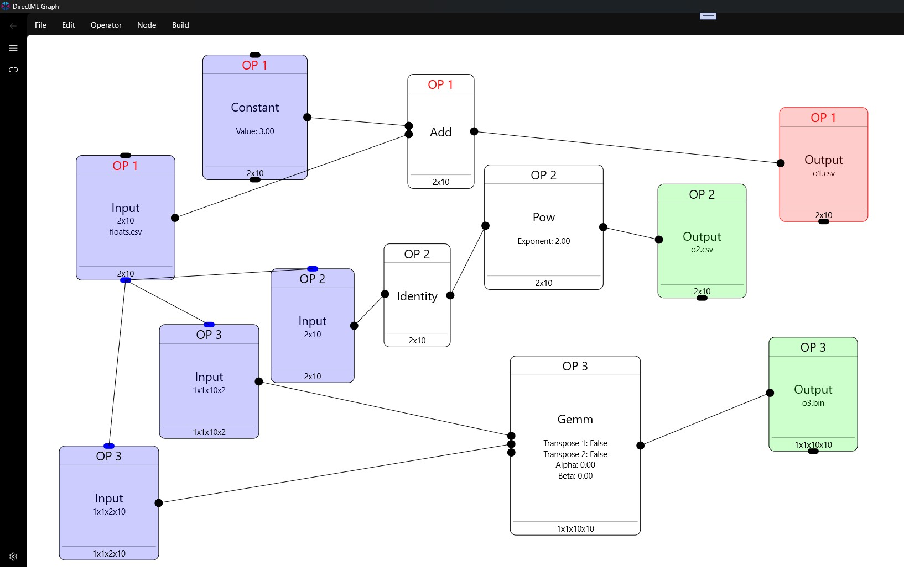

# DirectML Graph

A tool to visually-design DirectML operators that run in the GPU and to create and train a neural network with it.
Uses my [DirectML Lib](https://github.com/WindowsNT/directmllib).

## Features for DirectML Design

* Undo, Redo, Save, Load, Multiple Sets
* Multiple Visible/Active DirectML operators
* Direct2D Drawing
* Memory Sharing
* Input/Output CSV or binary, Input Random, Output to MessageBox
* Adapter Selection
* Show Adapter Memory Consumed

## Features for NN design

* Design a neural network
* MNIST-included dataset
* Adapter Selection
* Training on GPU
* Training on CPU
* Testing on GPU/CPU
* Batch training
* Saving/Loading model
* Saving as PTH or ONNX with Python installed
* Customizable network structure
* Customizable activation functions

## Supported Operators

* Activation: Celu,Elu,Gelu,HardMax,HardSigmoid,Identity,LeakyRelu,Linear,LogSoftmax,ParameterizedRelu,ParametricSoftplus,Relu,ScaledElu,ScaledTanh,Shrink,Sigmoid,Softmax,Softplus,Softsign,Tanh,ThresholdedRelu
* Batch Processing: BatchNormalization, BatchNormalizationGrad, BatchNormalizationTraining, BatchNormalizationTrainingGrad
* Comparison Operators: If, IsInfinity, IsNaN
* A: Abs,ACos,ACosh,Add,And,ASin,ASinh,ATan,ATanh,ATanYX,AveragePooling
* B: BitAnd, BitCount, BitOr, BitNot, BitShiftLeft, BitShiftRight, BitXor
* C: Cast, Ceil, Clip, ClipGrad, Constant, Cos, Cosh, Cummulative Sum/Product, Convolution
* D: DepthToSpace, Dequantize, DequantizeLinear, DifferenceSquare, Divide
* E: Erf, Exp, Equals
* F: Floor
* G: Gather, GatherElemends, GatherND, Gemm, GreaterThan, GreaterThanOrEqual
* I: Identity, 
* J: Join
* L: Log, LessThan, LessThanOrEqual
* M: Max,Mean,Min,Multiply,Modulus Floor,Modulus Truncate
* N: Neg, Not
* O: OneHot, Or
* P: Pow
* Q: QuantizedLinearConvolution, QuantizeLinear
* R: Recip, Reduce, Resample, Round, Reintrerpret, ReverseSubsequences
* S: Slice, SliceGrad, Subtract, Sqrt, Sign
* T: Threshold
* X: Xor  

## Screenshots

### ToDo

All other operators: 

	dml::ConvolutionInteger;
	dml::LocalResponseNormalization;
	dml::MaxPooling;
	dml::MeanVarianceNormalization;
	dml::NonZeroCoordinates;
	dml::Padding;
	dml::RandomGenerator;
	dml::ResampleGrad;
	dml::RoiAlign;
	dml::RoiAlignGrad;
	dml::ScatterElements;
	dml::SpaceToDepth;
	dml::TopK;
	dml::Upsample2D;
	dml::ValueScale2D;

