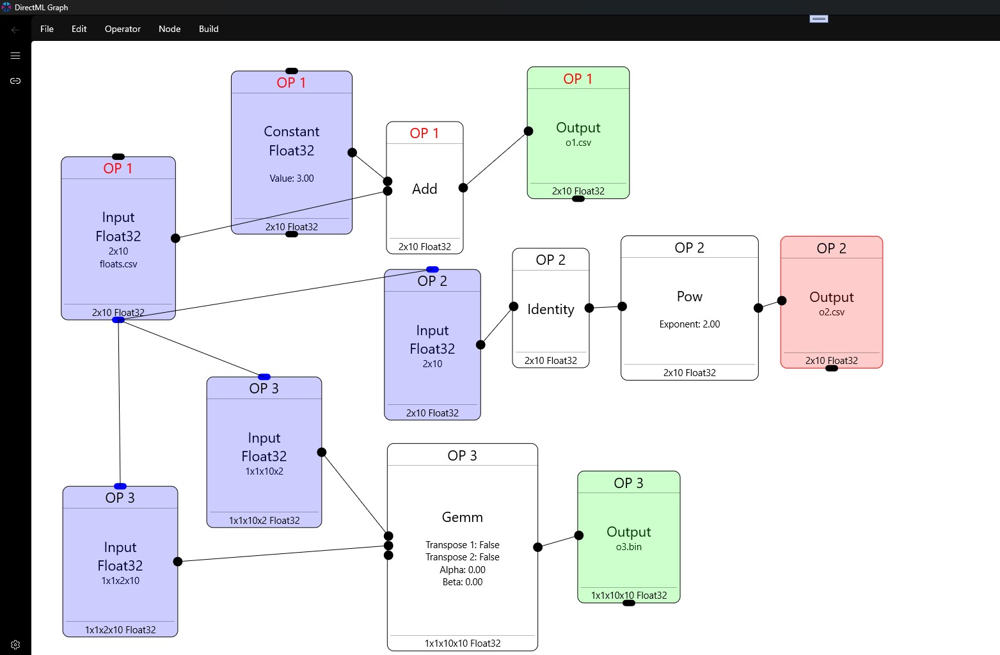

# DirectML Graph

A tool to visually-design DirectML operators that run in the GPU.
Uses my [DirectML Lib](https://github.com/WindowsNT/directmllib).

## Features

Undo, Redo, Save, Load, Multiple Sets

Multiple Visible/Active DirectML operators

Direct2D Drawing

Memory Sharing

Input/Output CSV or binary, Input Random, Output to MessageBox

Adapter Selection

Show Adapter Memory Consumed

## Supported Operators

Activation: Celu,Elu,Gelu,HardMax,HardSigmoid,Identity,LeakyRelu,Linear

A: Abs,ACos,ACosh,Add,And,ASin,ASinh,ATan,ATanh,ATanYX

B: BitAnd, BitCount, BitOr, BitNot, BitShiftLeft, BitShiftRight, BitXor

C: Cast, Ceil, Clip, Constant, Cos, Cosh, Cummulative Sum/Product, Convolution

D: Divide

E: Erf, Exp, Equals

F: Floor

G: Gemm, GreaterThan, GreaterThanOrEqual

I: Identity, If, IsInfinity, IsNaN

J: Join

L: Log, LessThan, LessThanOrEqual

M: Max,Mean,Min,Multiply,Modulus Floor,Modulus Truncate

N: Neg, Not

O: Or

P: Pow

R: Recip, Reduce, Resample, Round, Reintrerpret

S: Slice, Subtract, Sqrt, Sign

T: Threshold

X: Xor
### Pending

All other operators

Activation, Batch, 
quantizer  Split, Tile Topk, 

